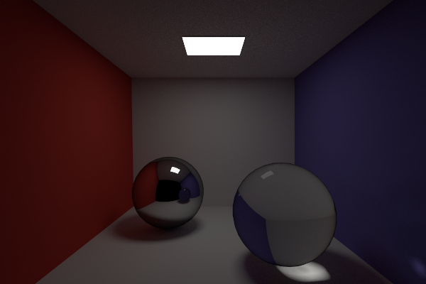

# Rusty the Rendering Engine



WIP physically based renderer.

## Features

- OpenGl preview
- Bidirectional path tracing
- Diffuse reflection
- Specular reflection + transmission
- Glossy reflection + transmission

## Installation

Requires a recent [rust](https://www.rust-lang.org/en-US/install.html) compiler (tested on 1.79)
```
git clone https://github.com/ItsHoff/Rusty.git
cd Rusty
cargo run --release
```

## Keybindings
| Key | Function |
|-----|----------|
| W A S D E Q | Move camera |
| Left Mouse + drag | Rotate camera |
| Arrow Keys | Rotate camera |
| Space | Start & stop path tracing |
| Number Keys | Change scene |
| F1 | Use path tracing |
| F2 | Use bidirectional path tracing |

## Loading scenes
Number keys change between the default scenes. Alternate scenes can be loaded by dragging and dropping a scene file into the window. Currently only .obj scenes are supported. Most scenes should render properly, but not all quirks will be supported.
